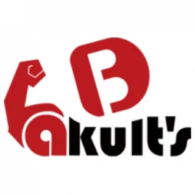

# Данный курс предназначен для Полины в изучении и понимании игры Dota 2

## Описание:
- Что такое Дота
- Принципы и суть игры
- Основные термины
- Популярные команды и за кого болеть 
- Турниры их виды и значимость + организаторы
- Вывод 

## Что такое Дота

Dota 2 — это не просто игра. Это культура, это спорт, это огромная вселенная со своей историей, драмами и легендами.

Если говорить технически, то:

Dota 2 (Defense of the Ancients 2) — это командная стратегическая компьютерная игра в жанре MOBA (Multiplayer Online Battle Arena) — Многопользовательская онлайновая боевая арена.

Это бесплатная игра от Valve(создатели стима и кс) в жанре моба, выпущенная в 2011 году за это время было несколько основных эр игры, впринцепи сами эры не особо нужны сейчас это больше как ностальгия. Сейчас дота остается одной из самых популярных онлайн игр в мире и так же в киберспорте. Дота ставила рекорды по призовому фонду за турнир (на The International) во всем мире. 

На этом в принцепи что такое дота все. Про нее можно больше что сказать но это ужде углубление в другие главы.

## Принципы и суть игры

Есть две стороны Radiant и Dire, свет и тьма,  в каждой команде по 5 игроков, всего у них выбор из 126 героев разделенных на 4 категории основных, симла, ловкость, интеллект и универсалы. Цель игры снести вражеский трон, это самое главное здание у каждой из команды. Для достижения этой цели игроки убивают крипов, забирают рошана, терзателя (в след пунтке объяснение этого всего). У каждой команды есть 3 линии, изи лайн, харда и мид. На каждой линии раз в 30 минут выбегают крипы, при убийстве которых герои получают золото и опыт.

## Основные термины

- **_Крипы_** - Это существа каждой из команд, которые управляются компьютером при убийстве которых герой, сделавший удар который убил, получает золото. Опыт дается просто при смерти в определенном радиусе и не важно кто нанес последний удар. Крипы делятся на 3 вида, ближний бой (милишник), дальний бой (дальник или ренж), катапульта.    
- **_Рошан_** -  Это главный крип на карте. Он стоит в одном из двух мест, на реке(сверху или снизу) каждые 5 минут он передвигается в другое место(днем и ночью). При его убийстве выпадает аегис, баннер, рефрешер и аганим. Чем больше его убиваешь, тем больше выпадают вещи с него(максимум 4 вещи), аегис выпадает всегда. Он воскрешается спустя минуты 3-7 с момента как пропал аегис.   
- **_Терзатель_** -  Объект на карте, что-то среднее между крипами и рошаном он не двигается, но прри смене времени дня меняет свое местоположение(всегда находится на другой стороне от рошана). При убийстве герой убившей команды получает шард(выббор делается между двумя героями с самой низкой стоимостью).   
- **_Наблюдатель/смотритель_** - Объекты на карте, при захвате которого команда получает вижн в определенной зонена некоторое время. Враг же может еще раз захватить его и тогда на время смотритель будет неактивен а команда потеряет вижн.   
- **_Бафф_** - Усиления себя или союзников на время или постоянно в радиусе действия.
- **_Дебафф_** - Ослабление врагов на время или постоянно в радиусе действия.
- **_Суммоны_** - призванные существа, чаще всего они живут определенное время.   
- **_Аегис_** - Предмет выпадающий при убийстве рошана. при поднятии его, он будет находиться в инвентаре героя 5 минут или пока не убьют героя. Простым языком аегис дает вторую жизнь.    
- **_Макро игра_** -  правильный закуп, хорошо ориентироваться по карте, слаженные командные действия и прочее "глобальное".
- **_Микро игра_** -  ластхит, умение всегда нажать то что надо .
- **_Аванпост_** -  Объект на карте, по одному для каждой команды, который позволяет телепоортироватсья на него. Так же при сносе вышки врага второго уровня(Т2) дается возможность захватывать аванпост врага.   
- **_Фонтан_** - Место возрождения героев, дает им восстановление здоровья и маны. На ней имеется лавка для покупки предметов а так же если зайдешь на фонтант врага он начнет тебя бить.   
- **_Курьер/кура_** - У каждого героя есть свой курьер, это как яндекс курьер, он доставляет героям предметы. Курьера можно убить и он будет воскрешаться некоторое время.  
   
- **_Расходники_** - это вещи которые чаще всего используются на старте игры, для восстановления здоровья или маны.  
- **_Линия_** - Это одно из трех направлений по которым бегут крипы. У каждой линии есть свое название.   
- **_Нейтралы_** - Это те же крипы, что бегут по линиям, но распологаются они в лесу и не имеют отношению ни к одной из сторон. Каждую минуту появляются новые при убийстве всего кэмпа. При убийстве так же получает золото и опыт как с обычных крипов, а так же падают осколки для создания нейтральных предметов    
- **_Кэмп_** - Область в лесу где возраждаются нейтралы  
   
- **_Нейтралка_** -  Это вещи которые создаются из осколков выпадающих из нейтралов. Есть 5 уровней вещей которые создаются постепенно по ходу игры.    
- **_Лотус_** - На боковых линиях распологаются пруды в которых раз в 3 минуты появляюся лотусы которые восстанавливают мгновенно здоровье и ману. Лотусы можно собирать они не ограничены по времени жизни.     
- **_Варды_** -  Предмет который покупается в лавке. их нужно ставить на карте, куда ставить решает сам человек, но важно что ставить так чтобы они давали максимально возможную информацию, есть два вида вардов:
    - **_Обсервер/обс_** - дает вижн для всей команды, но не раскрывает невидимых существ (желтые)
    - **_Сентрик_** - раскрывается невидимых сущест или вражеские варды в радиусе действия (синие).
       
- **_Смоки_** -  Предмет который при активации в радиусе действия позволяет героям "пропасть" с карты для врагов, но смок спадает при бриближении к врагам на определенное расстояние. 
   
- **_Эншенты_** -  Это нейтралы, но более сильные.    
- **_Скилл_** -  Способность которая есчть у каждого героя.
- **_Руна_** -  Объект на карте, всего 4 места их расположения, по два в каждом из лесу и 2 на реке. в лесу всегда появлются руны богатства, дающии золото всей команде. На реке же первые 4 минуты появляются руны воды, это аналогично лотусам но применение идет сразу после того как подобрали. На 6 и потом каждые 2 минуты появляется одна из следующих рун:
    - ДД - Увеличивает урон от атаки и от скиллов на время
    - Щит - Дает барьер который поглощает урон, здоровье барьера зависит от максимального хп героя
    - Иллюзия - Создает 2 иллюзии героя
    - Инвиз - Дает невидимость
    - Аркана - Уменьшает потребление маны у скиллов, а так же уменьшает кд 
    - Хоста - Увеличивает скорость передвижения героя
    - Регенка - Восстанавливает здоровье и ману героя или до полного значения или пока время действия не закончится
       
- **_Телепорт_** -  Позволяет быстро перемещаться на карте, можно делать телопорт на вышки, на аванпост и некоторые герои или предметы позволяют телепортироваться на крипов/героев или в любую точку на карте.
- **_Мудрость_** -  Тоже считается руной, но сейчас это как аванпост который нужно захватить чтобы герою захвативший его дали опытт, так же опытт дается герою с самым маленьким кол-вом опыта в команде.
   
- **_Айтем/шмотка_** - Предметы которые покупаются, дают разные характеристики и нужны для поолучения преимущества в битвах или в пуше. 
- **_Башня/Вышка/Тавер_** -  Сооружение на каждой из линий у обеих команд. Всего команд по 3 вышки на каждой из линий, а так же по две вышки у трона. Обычно говорят не вышка или тавер а Т1,T2,T3,T4
    - Т1 - Первая вышка на каждой из линий котоаря ближе всего к врагу
    - Т2 - Вышка расположеная близко к базе, но не на ней
    - Т3 - Перпвая вышка на базе которая защищает казармы
    - Т4 - Вышки защищающие трон 
       
- **_Хайграунд/лоуграунд_** -  Понятия которые обозначают расположение чего-либо на карте оотносительноо высоты.
    - Хайгрунд - это значит что выше, нужно забратсья повыше
    - Лоугрануд - это значит что ниже и нужноо спуститься.
Когда какой-либо дальник бьет с лоугрануда по герою/крипу на хайграунде то может выскачить мисс.
- **_Казармы/барак_** -  Сооружения находящиеся на каждой из линий на базе, есть казарма для крипов дальнего боя и для ближнего,  при разрушении казарм, команда сделавшая это получает усиление крипов на этой линии и на того типа, чей барак был разрушен    
- **_Аганим_** -  Предмет который усиливает способность героя или добавляет новую. Улучшения есть у каждого героя 
   
- **_Шард_** -  То же самое что аганим только менее силен чаще всего. Улучшения есть у каждого героя   
- **_Таланты_** -  На 10/15/20/25 уровнях, герои имеют возможность выбрать одно из 2 улучшений для себя, всего 8 талантов, начиная с 27 уровня можно выбрать второй талант на каждом уровне градации талантов    
- **_Аспект_** - При выборе героя, можно выбрать один из двух(иногда есть по 3 и более аспектов) вариантов твоего героя, чаще всего имеет какие-то бафы для героя.   
- **_Врожденная способность_** -  Способность которая есть у героя всегда, вне зависимоости от уровня и она одна и та же от игры к игре   
- **_Скан_** -  Функция интерфеса в доте, позволяющая выбрать область на карте и при наличие там врагов будет оповещение об этом
- **_Глиф_** - Защита сооружение(вышки/казармы/трон) при котором они не получают урон, имеет кд 5 минут, но в случае уничтожения первой T1 и T2, а так же казармы ближнего боя, глиф снова появляется  
- **_Нетворс_** - стоимость героя, сколько золота он получил за игру 
- **_Ульта_** - Самый глвынй скилл у героя, прокачивается на 6 уровне
- **_Сало_** - Безмолвие, дебаф при котором нельзя использовать скиллы
- **_Стан_** - Огулшеине, при котором герой ничего не может сделать
- **_Крит_** - Критический урон, $$урон\,героя * процент\,крита $$
- **_Мисс_** - Когда удар не проходит, герой грубо говоря уворачивается и не получает урон 
- **_Сплеш_** - Прорубающий урон, когда удар наносится по одной цели, а урон идет по конусу дальше
- **_Тычка_** - Удар
- **_Ганг_** - Чаще всего под смоками, когда неожиданно идет нападение на одного вражеского героя, когда тот этого не ожидает
- **_Кэрри_** - Роль в доте, который больше всего фармит(убивает крипов) для получения как можно боольше золота чтобы выиграть игру
- **_Миддер_** - Позиция на  которой играют на миду стоя  1 на 1, для получения как можно быстрее опыта и дальше идет гангать на другие линии чтобы помочь команде
- **_Саппорт_** - Позиция в доте которая ставит варды, делает стаки для мидера/керри/оффлейнера, чаще всего погибает он нежели керри, так как за саппортов мало дают золото так как они не фармят чаще всего 
- **_Оффлейнер_** - Чаще всего инициатор(тот кто начинает драки) 
- **_Флекс_** - Когда на стадии выбора героев берут героя который может пойти на несколько позиций, для запутывания врагов 
- **_Связка_** - Тут есть два значения
    1) Связка героев, два и более героя которые отлично сочетаются друг с другом
    2)  Игровая механика, при которой героя привязывают к месту и он может двигаться в определенной дистанции
- **_Дизейбл_** - Общее понятие для обезмолвия, стана, связки и так далее, любой дебафф 
- **_Мачап_** - противостояние двух героев разных команд, герой А и герой Б, как они играют друг против друга как на линии, так и по игре
- **_Харда_** - Название линии, для сил света это наверху, для сил тьмы это внизу
- **_Изи лайн_** - Аналогично харде, но наоборот для сил света это низ, для сила тьмы это верх
- **_Река_** - Это область которая течет с левого верхнего угла по правый нижний через мид, делит карту на территорию сил светы и сил тьмы
- **_Тройка_** - Обалсть на карте, возле потайной лавки (ббыла названа так как там было 3 кемпа, сейчас там их 2)  
- **_Лес_** - Область на карте между линиями 
  
- **_Отвод_** - Для того чтобы "сломать" линию для врага и сделать ее более удобнеой для керри, саппорты чаще всего отводят лайновых крипов на нейтралов
- **_Стак_** - Лесных крипов на кемпе можно увеличивать, если успеть вывести крипов из зоны возраждения в момент, когда они доллжны появиться, то появятся новые а старые останутся   
- **_Осколки/безумруды_** - предмет которые падают при убий стве лесных кроипов с помощью которых моожно создать нейтральные предметы
- **_Пуш_** - Ситуация в которой собирается вся команда и идет уничтожать вышки или бараки
- **_Гем_** - Предмет который в радиусе действия показывает нревидимых сущест и предметы, в отличии от сентри, он не ставитстя а носится в инвентаре 
- **_Ренжа_** - дальность действия или атаки
- **_КД_** -  Cooldown перезарядка предмета или скилла
- **_Дасты_** - Предмет который при использовании его в радиусе действия накладывает на всех существ деббафф который раскрывает невидимость    
- **_Баннер_** - Предмет выпадающий с рошана, он дает глиф на крипов в радиусее действия   
- **_Ластхит_** - Последний удар по крипу или героою 
- **_Вижн_** - Обзор карты, то что ты и твоя команлда видит
- **_Трон_** - Самое главное здание у каждой из команд в случае его разрушения команда проигрывает   
- **_Потайная лавка_** - Второй магазин в котором можно купить более дорогие и важные предметы    

## Популярные команды и за кого болеть

В данном пункте я разобью команды на регионы и в кажддом регионе выделю несколько команд а потом будет мировой топ и мое личное мнение 

- Северная Америка:
    - Shopify Rebellion 
     
    - WildCard
    
- Южная Америка:
    - Heroic
    
- Западная Европа:
    - Team Falcons
    
    - Nigma Galaxy
    
    - Tundra Esports
    
    - Team Liquid
    
    - Gaimin Gladiators
    
    - OG
    
    - Team Secret
    
- Восточная Европа (СНГ):
    - PARIVISION
    
    - Team Spirit
    
    - BetBoom Team
    
    - Aurora Gaming
    
    - Virtus Pro
    
    - Natus Vincere
    
- Китай:
    - Xtreme Gaming
    
    - Team Tidebound
    
    - Yakult Brothers
    
- Юго-Восточная Азия:
    - Talon
    
    - BOOM Esports
    

Но это просто по регионам Если выделить просто сильных в доте на 15/09/2025 то это
- Team Falcons
- Xtreme Gaming
- PARIVISION
- Team Spirit
- BetBoom Team

Из них болеть на Спиритов наши сибирские с таганрока, так же за BB (BetBoom) и PARIVISION

## Турниры их виды и значимость + организаторы

В Доте 7 основных каст организаторов:
- ESL (вроде и онлайн и офлайн)
- BLAST (вроде и онлайн и офлайн)
- PGL (вроде и онлайн и офлайн)
- Perfect World (в Китае) ( вроде и онлайн и офлайн)
- BetBoom (бетка ебет) (только онлайн турниры как помню)
- FISSURE (только онлайн турниры как помню)
- DreamLeague (только онлайн турниры как помню)

По турнирам самый главный это **The International** проходит раз в год в августе/сентябре, второй поо значимости это **Riyadh Masters** проходящий в июле +- в Рияде, Саудовская Арабия. Потом идут Major турниры которые организуют уже выше показаные организаторы, такой статус имеют турниры которые прошли условия некоторые. Так же есть просто турниры, чаще всего сезонные такие проводят чаще всего DreamLeague
